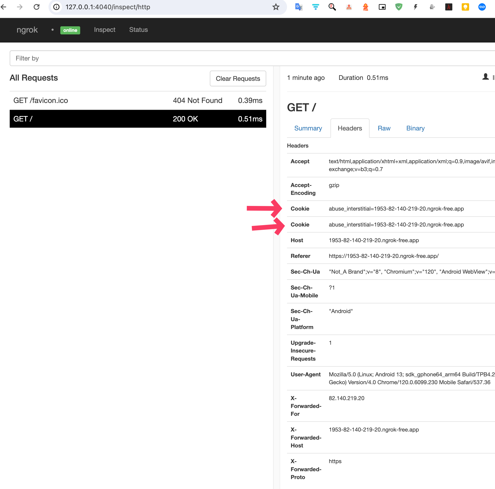

## Reproduction error

### Step 1

https://ngrok.com/download

```bash
ngrok http "file://$(pwd)/"
```

### Step 2
Copy
 1. address `https://xxx-x-xx-xxx-x.ngrok-free.app` to `src/js/capacitor-welcome.js`
 1. and domain `xxx-x-xx-xxx-x.ngrok-free.app` to `capacitor.config.json:7`

```bash
npm run build && npx cap sync
```

Open http://127.0.0.1:4040

### Step 3

Run android app


